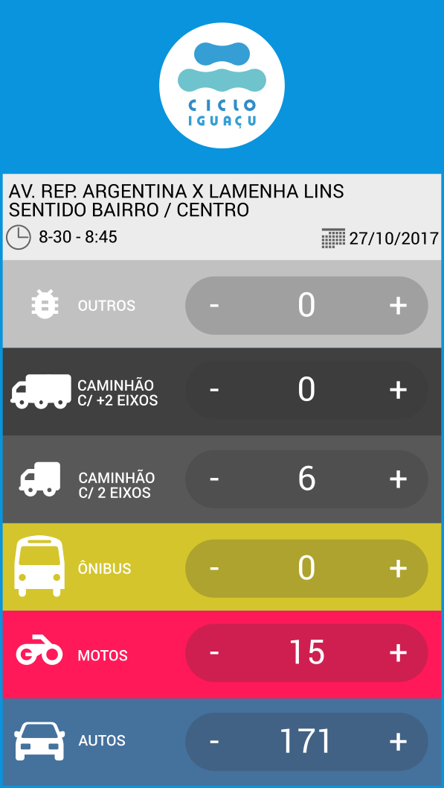
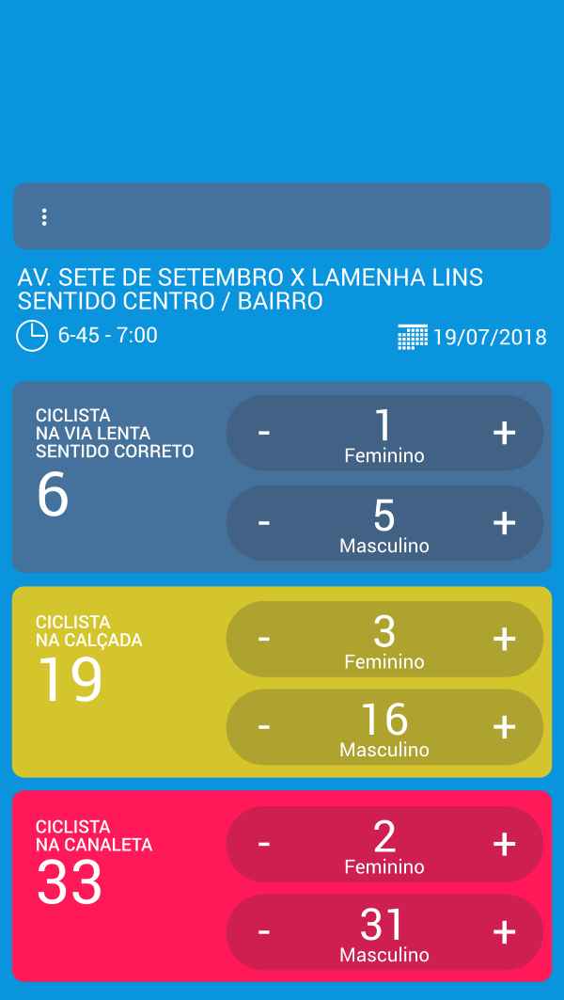
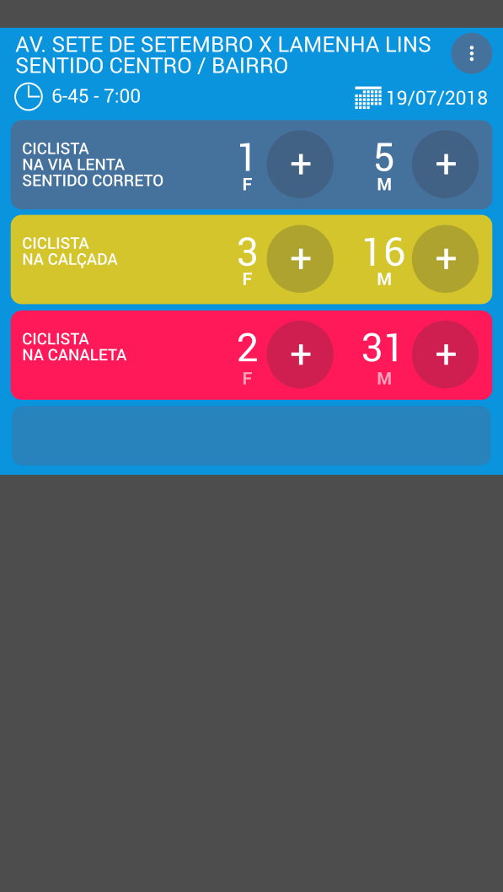
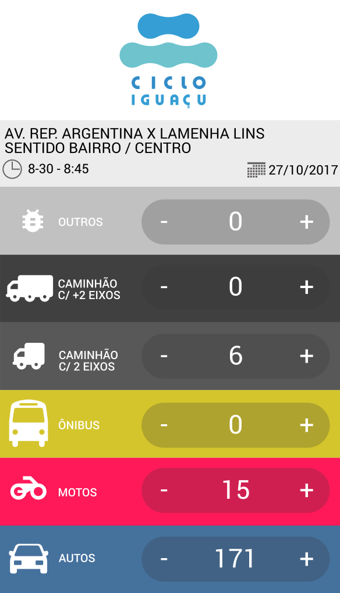
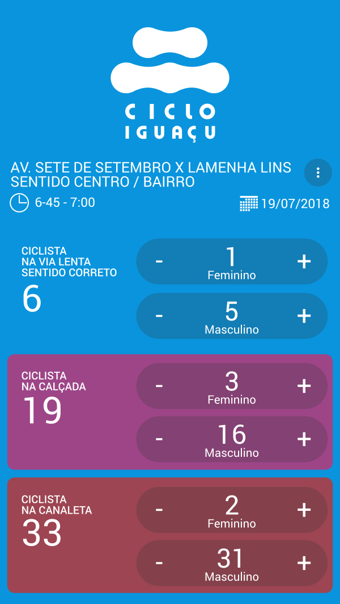
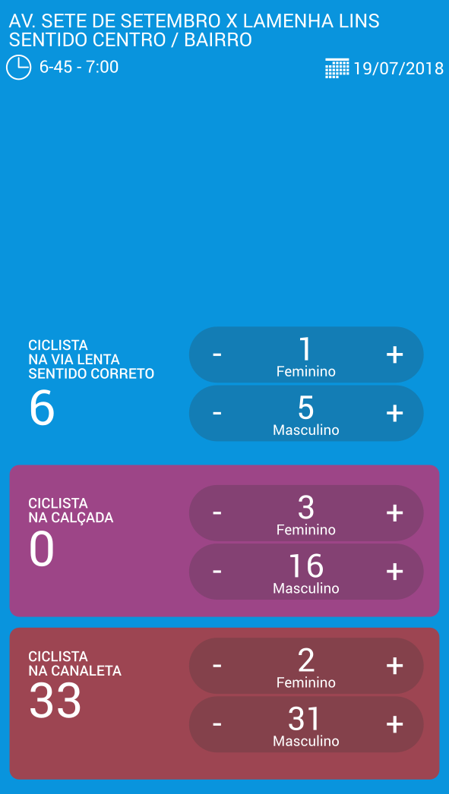
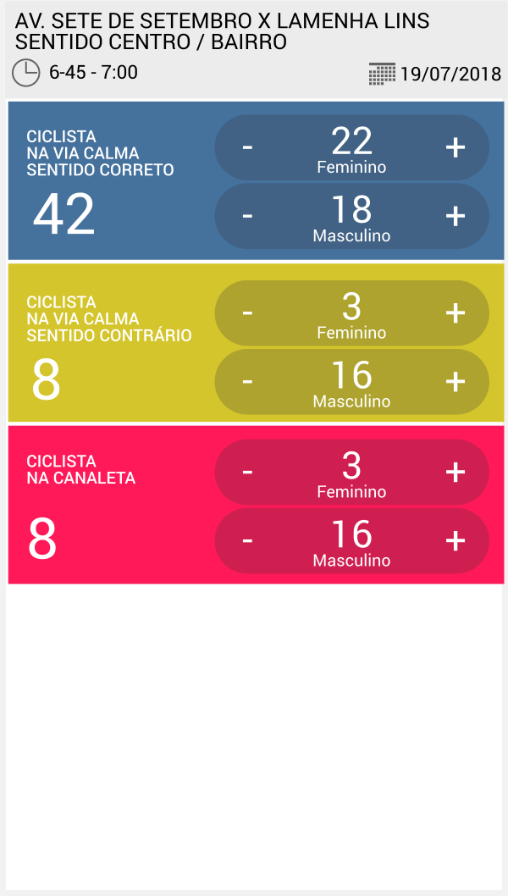
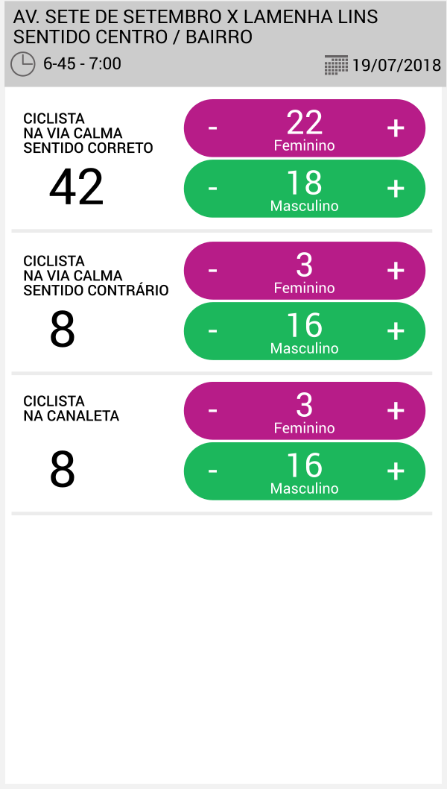
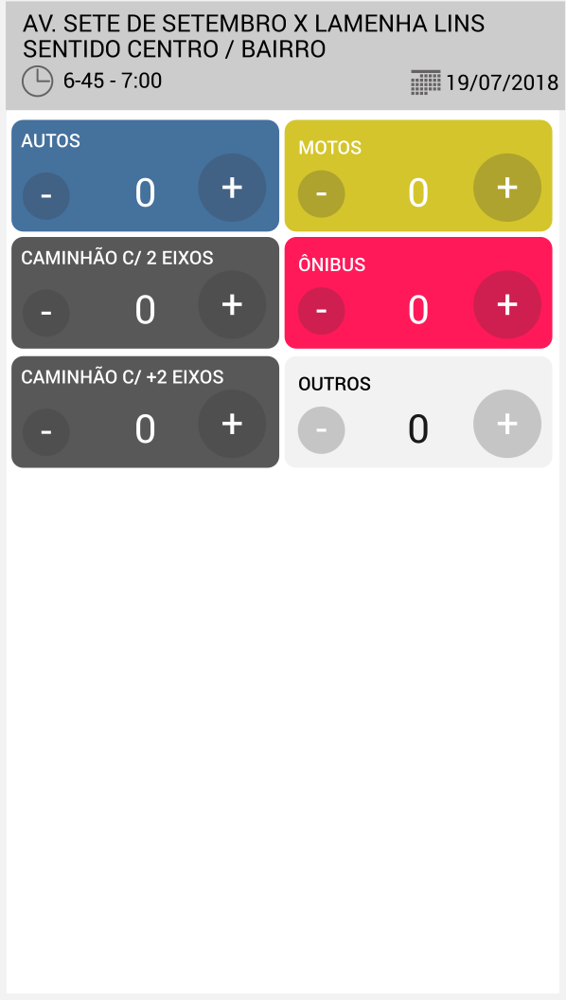
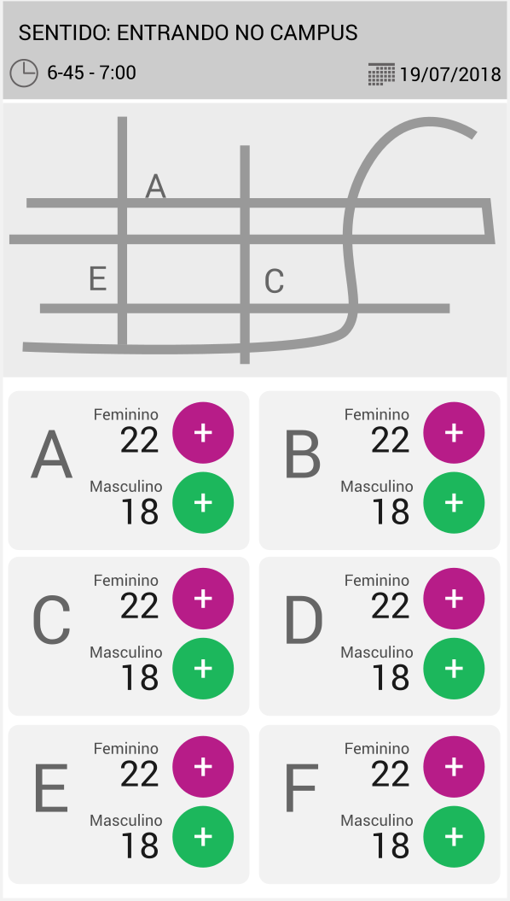

# contador
Contador digital para smartphones

A Cicloiguaçu realiza históricas contagens na região da Av. 7 de Setembro e República Argentina.
Pretendemos testar uma solução digital que facilite a compilação dos dados.

## Estágio atual:
- Desenvolvimento da interface web + protótipo funcional e reaproveitável

## Rascunhos:

